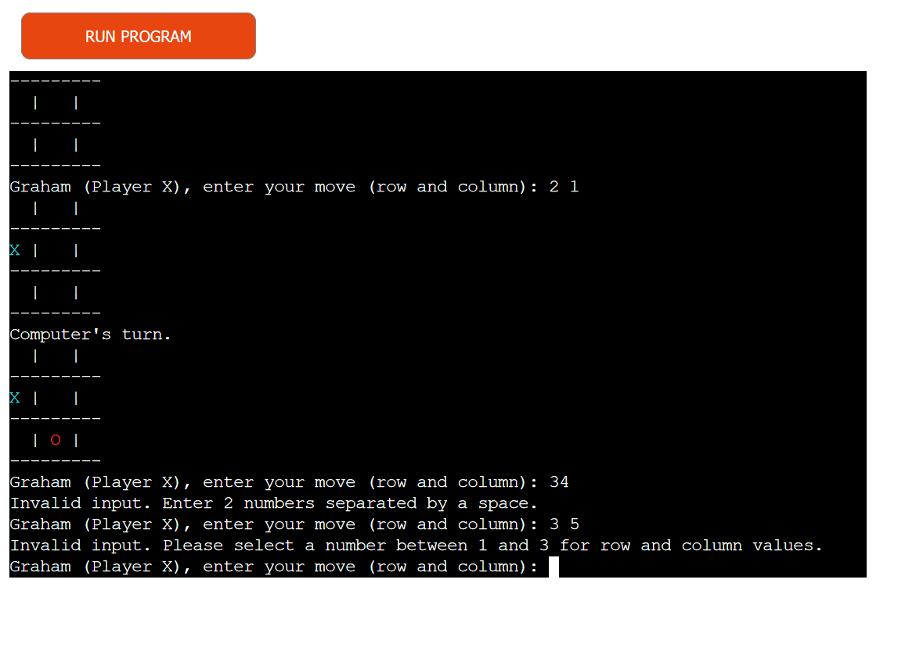

# NOUGHTS AND CROSSES

Noughts and Crosses is a simple game where the play tries to connect 3 in a row. Either vertically, horizontally or even diagonally.
Game was designed on gitpod using Python and deployed to Heroku

## Table of contents
 -  [User](#user)
    - [First time user](#first-time-user) 
 - [Features](#features)
    - [Name input](#name-input)
    - [Print board and rules](#print-board-and-rules)
    - [Valid and invalid](#valid-and-invalid-inputs)
    - [Play agian option](#play-again-option)
 - [Technologies used](#technologies)
 - [Libraries used](#libraries-used)
 - [Testing](#testing)
 - [Bugs](#bugs)
 - [Development and Deployment](#development-and-deployment)
 - [Credits](#credits)

## User
  ### First time user
  - Play a simple game of noughts and crosses against the pc.
  - Step by step instructions on how to use it.
  - Rules to the game.
  - See your move on the board that will be printed as well as the pc move
  - Option to play again or quit.

## Features
 ### Name input
 Start of the game a message will appear with an input space to insert your player name.

 

 ### Print board and rules
 After inputting your name it will be printed along with a brief summary of how to play the game and the board will be printed waiting for you first move.

 

 ### Valid and Invalid inputs
 Invalid input numbers above 3.

 

 Invalid input spot already taken.

 

 Invalid input no space between the 2 given numbers.

 

 Valid input

 

 ### Play again option
 Print win, loss or draw message and give the option to play again.

 

## Technologies used
- Python
- Github
- Gitpod
- Heroku
- Python Linter
- Black Playground

## Libraries used
- [Random](https://docs.python.org/3/library/random.html)
- [Colorama](https://pypi.org›project›colorama)

## Testing
Ran code through CI Python Linter, errors given were codes were to long, corrected them.

## Bugs
Corrected syntax errors and indentation problems. Grammar errors and a error where the game didn't end when adding colorama, added the code to winning condition.

No other bugs known

## Development and deployment

   - Cloning this repository from CI template
   - Create a new Heroku app select the region and name it
   - Add the buildpack in settings for Python first and then for Node Js
   - Creating a Config Var called PORT with a value of 8000
   - Link the Heroku app to the repository in Github
   - Click Deploy

## Credits
   - https://www.101computing.net/a-python-game-of-noughts-and-crosses/ -Assistance with design
   - https://stackoverflow.com/questions/41621982/python-noughts-and-crosses -Assistance with common errors
   - https://www.youtube.com/watch?v=kojoQkZ8LfA Quick Code in Python: Tic Tac Toe (Noughts & Crosses) Learn to Code GCSE -Ideas and assistance with building the game
   - Love sandwiches walkthrough project -Get Heroku up and running
   - https://github.com/Shaf8808/battleships/blob/main/README.md -Help with readme file and print the board
